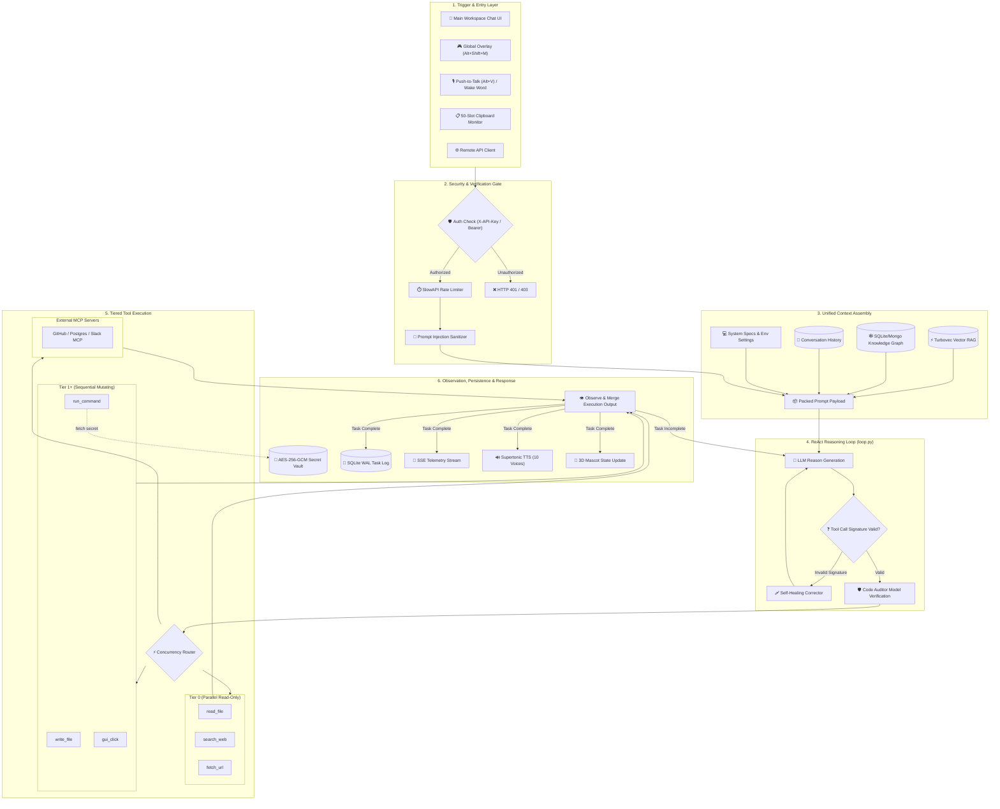

# MERIDIAN-X SYSTEM ARCHITECTURE & TECHNICAL CONTEXT DOCUMENT
> **Target Audience**: AI Agents & Technical Automation Parsers  
> **Repository Roots**:  
> Core Application: `c:/Users/aryan/OneDrive/Dokumen/Mini_Project/Meridian-X`  
> Website/Marketing: `c:/Users/aryan/OneDrive/Dokumen/Mini_Project/meridian_website`  

---

## 1. PROJECT OVERVIEW & TECHNOLOGY STACK

- **Name**: Meridian-X
- **Type**: Agentic Desktop Workspace Companion & Autonomous ReAct Engine
- **OS Support**: Windows 11 (64-bit), macOS 12+ (Apple Silicon/Intel), Linux (Ubuntu/Debian/Arch/Fedora)
- **Frontend Stack**: Tauri v2, React 18, TypeScript, Vite, Three.js (3D Mascot), Anime.js, Tailwind CSS, Lucide Icons
- **Backend Stack**: Python 3.10+, FastAPI (Async), Uvicorn, SlowAPI, Pydantic v2, PyInstaller
- **Inference Layer**:
  - Local LLMs via Ollama (`Llama 3.2`, `Llama 3.1`, `Qwen 2.5`, `Mistral`)
  - Cloud Providers (OpenAI, Anthropic, Gemini, Groq, OpenRouter, DeepSeek)
- **Storage Layer**: Turbovec (Sub-ms Vector RAG), SQLite WAL (`database.py`), MongoDB (Graph RAG Sync)
- **Voice Engine**: Supertonic local TTS (10 voices), Faster-Whisper local STT, OpenWakeWord engine

---

## 2. COMPLETE FEATURE & CAPABILITY MATRIX

### 🧠 Autonomous ReAct Reasoning Engine
- Asynchronous **Reason -> Act -> Observe** iterative loop (`meridian_backend/src/core/loop.py`).
- **Self-Healing Parameter Engine**: Automatically catches tool schema signature mismatches against `TOOL_REGISTRY` and re-injects corrected arguments.
- **Code Auditor Model**: Secondary model checks Python/JSON execution blocks for logic and security bugs prior to execution.
- **Live SSE Streaming**: Telemetry streams thought process (`PLANNING`, `EXEC`, `STATUS`, `WARNING`) in real time to UI via Server-Sent Events.

### 🚀 Non-Techie Onboarding Wizard
- **Hardware Spec Detection** (`hardware_detector.py`): Checks system CPU cores, RAM, and NVIDIA VRAM (`pynvml`) to classify machine into `Entry` (<8GB), `Mid` (8-16GB), or `High` (>16GB) tier.
- **Ollama Auto-Discovery & Multi-Port Scan** (`ollama_manager.py`): Scans ports `11434`, `11435`, `8080`, `5000` and `PATH` binaries without requiring manual host configuration.
- **Real-Time Model Puller**: Streams `ollama pull <model>` percentage via SSE directly inside setup modal (`OnboardingWizard.tsx`).

### 🌐 Remote Backend & Self-Hosting
- **Docker Stack**: Ready-to-use `docker-compose.yml` deploying `meridian_backend` and `ollama` with persistent volume bindings.
- **Multi-Backend URL Switcher** (`ServerConnectionModal.tsx` & `config.ts`): User configures remote server URL (`MERIDIAN_REMOTE_BACKEND_URL`) and authorization API key (`MERIDIAN_REMOTE_API_KEY`) stored in `localStorage`.

### 🔐 Encrypted Secret Vault
- AES-256-GCM credential vault (`vault.py`) tied to machine hardware passphrase derivation (`hostname + username + salt`).
- Manages keys for OpenAI, Anthropic, Gemini, Groq, DeepSeek, Tavily, Discord, and Telegram.

### 🔌 MCP (Model Context Protocol) Integration
- **Server Marketplace**: Dynamic tool registration for PostgreSQL, GitHub, Linear, and Slack MCP servers (`mcp_client.py`).
- **Reverse MCP Server**: Exposes Meridian-X's internal tool registry (`TOOL_REGISTRY`) as an MCP server at `/api/mcp/v1/tools` for external IDE consumption.

### ⚡ Speculative Concurrency Concurrency Router
- **Tier 0 Read-Only Tools** (`read_file`, `list_directory`, `search_web`): Executed concurrently via `asyncio.gather()`.
- **Tier >= 1 Mutating Tools** (`write_file`, `run_command`, `gui_click`): Executed sequentially inside transactional safety gates.

### 🛡️ Enterprise Security Gateways (`SEC-01` to `SEC-26`)
- `X-API-Key` Auth dependency (`require_api_key`).
- `SlowAPIMiddleware` rate-limiting (20 req/min chat, 10 req/min vault).
- Prompt Injection Sanitizer stripping jailbreaks and hidden unicode exploits (`prompt_injection.py`).
- `MERIDIAN_ALLOW_HOST_CODE_EXEC` environment flag gating local terminal command execution.

### 📋 Clipboard Surveillance & Focus Shield
- 50-slot persistent clipboard history listener (`clipboard.py`).
- Distraction Blocker blocking distracting URLs (`YouTube`, `Reddit`, `Twitter`) and background processes (`discord.exe`, `steam.exe`).

### 🦊 Interactive Mascot & Frameless HUD
- Three.js 3D orbital-ring mascot reflecting AI cognitive state (Blue = Idle, Amber = Working, Red = Error, Green = Success).
- Global shortcuts: `Alt+M` (Toggle Workspace), `Alt+Shift+M` (Toggle Mascot Island), `Alt+V` (Push-to-Talk Voice).

---

## 3. FULL SYSTEM DATAFLOW & WORKFLOW GRAPH

---

## 4. REST API ENDPOINTS SPECIFICATION

| Endpoint | Method | Params / Body | Description |
|:---|:---|:---|:---|
| `/api/health` | `GET` | None | Returns system health, version, and daemon status |
| `/api/onboarding/hardware-spec` | `GET` | None | Returns detected CPU cores, RAM GB, GPU VRAM, and model tier recommendation |
| `/api/onboarding/ollama-status` | `GET` | None | Scans ports & PATH for running Ollama service and installed models |
| `/api/onboarding/models/pull` | `POST` | `{ "model_name": "llama3.2:3b" }` | Streams `ollama pull` progress percentage via SSE event stream |
| `/api/chat/stream` | `POST` | `{ "prompt": str, "model": str }` | Executes ReAct loop and streams thought events via SSE |
| `/api/chat/confirm` | `POST` | `{ "id": str, "approved": bool }` | Resolves safety gate confirmation prompt for Tier 2 mutating actions |
| `/api/vault/keys` | `POST` | `{ "provider": str, "key": str }` | Encrypts API credential into AES-GCM vault |
| `/api/profile/save` | `POST` | Profile JSON dict | Saves persistent settings to SQLite database |
| `/api/profile/all` | `GET` | None | Fetches all stored user settings and configuration keys |
| `/api/mcp/v1/tools` | `GET` | None | Returns reverse MCP server tool schemas |

---

## 5. LOCAL STORAGE & ENVIRONMENT KEYS REFERENCE

| Storage Key | Type | Description |
|:---|:---|:---|
| `MERIDIAN_ONBOARDED` | `localStorage` | `'true'` if initial non-techie onboarding completed |
| `MERIDIAN_REMOTE_BACKEND_URL` | `localStorage` | Custom remote server target URL override (e.g. `https://api.my-server.com`) |
| `MERIDIAN_REMOTE_API_KEY` | `localStorage` | Custom authorization API key for remote backend |
| `MERIDIAN_MODEL` | `localStorage` | Selected offline/cloud LLM model ID |
| `MERIDIAN_PROVIDER` | `localStorage` | Provider identifier (`ollama`, `openai`, `gemini`, `anthropic`, `deepseek`) |
| `OLLAMA_HOST` | `.env` / Process | Ollama service endpoint address (default: `http://127.0.0.1:11434`) |
| `MERIDIAN_ALLOW_HOST_CODE_EXEC` | `.env` | Controls permission for executing host system commands |
