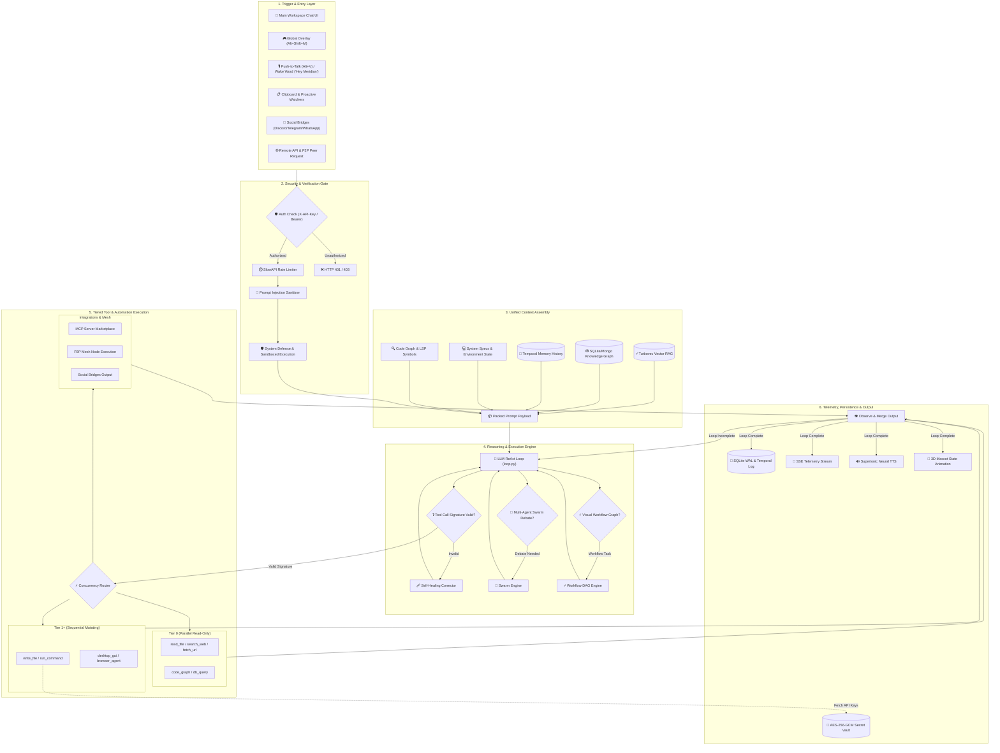

# MERIDIAN-X SYSTEM ARCHITECTURE & TECHNICAL CONTEXT DOCUMENT

> **Target Audience**: AI Agents, Technical Automation Parsers & Developers  
> **Repository Roots**:  
> Core Application: `c:/Users/aryan/OneDrive/Dokumen/Mini_Project/Meridian-X`  
> Website/Marketing: `c:/Users/aryan/OneDrive/Dokumen/Mini_Project/meridian_website`  

---

## 1. PROJECT OVERVIEW & TECHNOLOGY STACK

- **Name**: Meridian-X
- **Type**: Agentic Desktop Workspace Companion, Autonomous ReAct Engine & Multi-Agent Ecosystem
- **OS Support**: Windows 11 (64-bit), macOS 12+ (Apple Silicon/Intel), Linux (Ubuntu/Debian/Arch/Fedora)
- **Frontend Stack**: Tauri v2, React 18, TypeScript, Vite, Three.js (3D Mascot), Anime.js, Tailwind CSS, Lucide Icons
- **Backend Stack**: Python 3.10+, FastAPI (Async), Uvicorn, SlowAPI, Pydantic v2, PyInstaller
- **Inference Layer**:
  - Local LLMs via Ollama (`Llama 3.2`, `Llama 3.1`, `Qwen 2.5`, `Mistral`)
  - Cloud Providers (OpenAI, Anthropic, Gemini, Groq, OpenRouter, DeepSeek)
- **Storage & RAG Layer**: Turbovec (Sub-ms Vector RAG), SQLite WAL (`database.py`), MongoDB (Graph RAG Sync), Temporal Graph Engine
- **Voice Engine**: Supertonic local TTS (10 voices), Faster-Whisper local STT, OpenWakeWord ONNX Engine ("Hey Meridian")
- **Automation & Integration**: Model Context Protocol (MCP), Playwright Web Agent, Desktop GUI Macros, LSP Code Server, P2P Mesh Network

---

## 2. COMPLETE FEATURE & CAPABILITY MATRIX

### 🧠 Autonomous ReAct Reasoning Engine
- Asynchronous **Reason -> Act -> Observe** iterative loop (`meridian_backend/src/core/loop.py`).
- **Self-Healing Parameter Engine**: Automatically catches tool schema signature mismatches against `TOOL_REGISTRY` and re-injects corrected arguments.
- **Code Auditor Model**: Secondary model checks Python/JSON execution blocks for logic and security bugs prior to execution.
- **Live SSE Streaming**: Telemetry streams thought process (`PLANNING`, `EXEC`, `STATUS`, `WARNING`) in real time to UI via Server-Sent Events.

### 🚀 Non-Techie Onboarding Wizard
- **Hardware Spec Detection** (`hardware_detector.py`): Checks system CPU cores, RAM, and NVIDIA VRAM (`pynvml`) to classify machine into `Entry` (<8GB), `Mid` (8-16GB), or `High` (>16GB) tier.
- **Ollama Auto-Discovery & Multi-Port Scan** (`ollama_manager.py`): Scans ports `11434`, `11435`, `8080`, `5000` and `PATH` binaries without requiring manual host configuration.
- **Real-Time Model Puller**: Streams `ollama pull <model>` percentage via SSE directly inside setup modal (`OnboardingWizard.tsx`).

### 👥 Multi-Agent Swarm & Debate Engine
- Multi-perspective autonomous debate between customized agent personas (`swarm.py`, `SwarmDebate.tsx`).
- Parallel agent reasoning synthesis for complex problem-solving and adversarial consensus validation.

### ⚡ Visual Workflow & DAG Engine
- Node-based visual automation graph builder (`workflow_engine.py`, `WorkflowBuilder.tsx`).
- Sequential and conditional execution DAGs combining LLM steps, shell scripts, API calls, and watcher triggers.

### 🌐 P2P Mesh Network & Encrypted Peer Offloading
- Distributed peer-to-peer node discovery and handshake (`p2p.py`, `p2p_crypto.py`).
- End-to-end encrypted task offloading between trusted LAN/WAN Meridian-X nodes.

### 📚 Combined Vector RAG & Knowledge Graph
- Sub-millisecond vector indexing using Turbovec engine (`rag_optimizer.py`).
- Entity-relationship Knowledge Graph synchronized across SQLite WAL and optional MongoDB (`graph_rag.py`, `graph_sync.py`).
- Automated document chunking, indexing, and context synthesis (`doc_indexer.py`, `doc_generator.py`).

### 🎙️ Full Duplex Voice & Wake-Word Engine
- Hands-free ONNX wake-word listener for "Hey Meridian" (`wakeword.py`).
- Real-time continuous speech-to-text with Faster-Whisper (`stt.py`) and 10-voice neural text-to-speech with Supertonic (`tts.py`, `duplex.py`).

### 🔍 Code Graph & LSP Client Engine
- Language Server Protocol integration for deep code AST analysis, symbol references, and type checking (`lsp_client.py`, `code_graph.py`).
- Automated code quality reviewer and lint verification (`auto_reviewer.py`).

### 🤖 Social & Communication Bridges
- Out-of-the-box bidirectional bot integrations for Discord (`discord_bridge.py`), Telegram (`telegram_bridge.py`), and WhatsApp (`whatsapp_manager.py`).

### ⏱️ Proactive Watchers, Triggers & Background Scheduler
- File and system state monitoring background watchers (`watcher.py`, `triggers.py`).
- Scheduled CRON and interval task executor (`scheduler.py`, `task_scheduler.py`).
- Proactive event detection and auto-healing proposal generation (`proactive.py`).

### 🖥️ Desktop & Web Browser Automation Agent
- Headless and visual Playwright browser agent (`browser_agent.py`, `web_browser.py`).
- GUI desktop interaction, mouse/keyboard macro recording and playback (`desktop.py`, `recording.py`).

### ⏳ Temporal Memory & History Rollback
- Granular conversation session state snapshots and time-travel rollback (`temporal_memory.py`, `history_manager.py`, `Timeline.tsx`).
- Exportable chat sessions and historical task telemetry log.

### 🎨 Local Studio & Model Management
- Management interface for local GGUF / Ollama models (`LocalStudio.tsx`, `ollama_manager.py`).
- Real-time performance metrics, VRAM usage tracking, and model switching.

### 🌐 Remote Backend & Self-Hosting
- **Docker Stacks**: Standard `docker-compose.yml` (direct IP) and production `docker-compose.prod.yml` (automated Caddy SSL reverse proxy).
- **Deployment Guide**: Comprehensive step-by-step setup documentation in [`docs/SELF_HOSTING.md`](docs/SELF_HOSTING.md).
- **Multi-Backend URL Switcher** (`ServerConnectionModal.tsx` & `config.ts`): User configures remote server URL (`MERIDIAN_REMOTE_BACKEND_URL`) and authorization API key (`MERIDIAN_REMOTE_API_KEY`) stored in `localStorage`.

### 🔐 Encrypted Secret Vault
- AES-256-GCM credential vault (`vault.py`) tied to machine hardware passphrase derivation (`hostname + username + salt`).
- Manages keys for OpenAI, Anthropic, Gemini, Groq, DeepSeek, Tavily, Discord, Telegram, and custom webhooks.

### 🔌 MCP (Model Context Protocol) Integration
- **Server Marketplace**: Dynamic tool registration for PostgreSQL, GitHub, Linear, and Slack MCP servers (`mcp_client.py`).
- **Reverse MCP Server**: Exposes Meridian-X's internal tool registry (`TOOL_REGISTRY`) as an MCP server at `/api/mcp/v1/tools` for external IDE consumption.

### ⚡ Speculative Concurrency Router
- **Tier 0 Read-Only Tools** (`read_file`, `list_directory`, `search_web`): Executed concurrently via `asyncio.gather()`.
- **Tier >= 1 Mutating Tools** (`write_file`, `run_command`, `gui_click`): Executed sequentially inside transactional safety gates.

### 🛡️ Enterprise Security Gateways (`SEC-01` to `SEC-26`)
- `X-API-Key` Auth dependency (`require_api_key`).
- `SlowAPIMiddleware` rate-limiting (20 req/min chat, 10 req/min vault).
- Prompt Injection Sanitizer stripping jailbreaks and hidden unicode exploits (`prompt_injection.py`).
- System Defense Shield and Sandboxed Execution Runner (`system_defense.py`, `sandbox_runner.py`).
- `MERIDIAN_ALLOW_HOST_CODE_EXEC` environment flag gating local terminal command execution.

### 📋 Clipboard Surveillance & Focus Shield
- 50-slot persistent clipboard history listener (`clipboard.py`).
- Distraction Blocker blocking distracting URLs (`YouTube`, `Reddit`, `Twitter`) and background processes (`discord.exe`, `steam.exe`).

### 🦊 Interactive Mascot & Frameless HUD
- Three.js 3D orbital-ring mascot reflecting AI cognitive state (Blue = Idle, Amber = Working, Red = Error, Green = Success).
- Global shortcuts: `Alt+M` (Toggle Workspace), `Alt+Shift+M` (Toggle Mascot Island), `Alt+V` (Push-to-Talk Voice).

---

## 3. FULL SYSTEM DATAFLOW & WORKFLOW GRAPH



---

## 4. REST API ENDPOINTS SPECIFICATION

| Endpoint | Method | Params / Body | Description |
|:---|:---|:---|:---|
| `/api/health` | `GET` | None | Returns system health, version, and background daemon status |
| `/api/diagnostics` | `GET` | None | Detailed system diagnostic report and system resource usage |
| `/api/system-usage` | `GET` | None | Real-time CPU, RAM, and GPU VRAM consumption metrics |
| `/api/onboarding/hardware-spec` | `GET` | None | Returns CPU cores, RAM GB, GPU VRAM, and model tier classification |
| `/api/onboarding/ollama-status` | `GET` | None | Scans ports & PATH for active Ollama service and installed models |
| `/api/onboarding/models/pull` | `POST` | `{ "model_name": str }` | Streams `ollama pull` progress percentage via SSE event stream |
| `/api/chat` | `POST` | `{ "prompt": str, "model": str }` | Standard synchronous chat endpoint |
| `/api/chat/stream` | `POST` | `{ "prompt": str, "model": str }` | Executes ReAct loop and streams thought events via SSE |
| `/api/chat/confirm` | `POST` | `{ "id": str, "approved": bool }` | Resolves safety gate confirmation prompt for Tier 2 mutating actions |
| `/api/chat/history` | `GET` | None | Fetches conversation memory history |
| `/api/chat/clear` | `POST` | None | Clears active chat conversation buffer |
| `/api/swarm/stream` | `GET` / `POST` | `{ "topic": str, "agents": list }` | Streams multi-agent swarm debate deliberation via SSE |
| `/api/proactive/stream` | `GET` | None | Real-time SSE stream of proactive agent recommendations |
| `/api/watcher/start` | `POST` | `{ "path": str, "rule": str }` | Starts file system watcher trigger |
| `/api/watcher/stop` | `POST` | `{ "watcher_id": str }` | Stops active file system watcher |
| `/api/watcher/list` | `GET` | None | Lists running file system watchers |
| `/api/scheduler/runs` | `GET` | None | Retrieves history of scheduled job executions |
| `/api/scheduler/create` | `POST` | `{ "cron": str, "task": str }` | Schedules automated recurring background task |
| `/api/history/rollback` | `POST` | `{ "snapshot_id": str }` | Rolls back workspace state to historical snapshot |
| `/api/rag/ingest` | `POST` | `{ "text": str, "metadata": dict }` | Ingests raw text into Turbovec vector RAG |
| `/api/rag/ingest-file-upload` | `POST` | File Upload | Uploads and indexes PDF/TXT/MD document into RAG & Knowledge Graph |
| `/api/rag/search` | `POST` | `{ "query": str, "top_k": int }` | Queries hybrid vector and graph RAG memory |
| `/api/tts` | `POST` | `{ "text": str, "voice": str }` | Synthesizes voice audio using Supertonic TTS |
| `/api/voice/onnx-models` | `GET` | None | Lists available ONNX voice models and wake-word configurations |
| `/api/vault/keys` | `POST` | `{ "provider": str, "key": str }` | Encrypts API credential into AES-256-GCM vault |
| `/api/security/rotate-key` | `POST` | None | Rotates system authorization key and updates encrypted vault |
| `/api/sandbox/run` | `POST` | `{ "code": str, "language": str }` | Executes code snippet inside isolated sandbox runner |
| `/api/profile/save` | `POST` | Profile JSON dict | Saves persistent settings to SQLite database |
| `/api/profile/all` | `GET` | None | Fetches all stored user settings and configuration keys |
| `/api/mcp/v1/tools` | `GET` | None | Returns reverse MCP server tool schemas for IDE consumption |
| `/api/mcp/config` | `GET` / `POST` | Config JSON | Reads or updates external MCP marketplace configuration |

---

## 5. LOCAL STORAGE & ENVIRONMENT KEYS REFERENCE

| Storage / Env Key | Type | Description |
|:---|:---|:---|
| `MERIDIAN_ONBOARDED` | `localStorage` | `'true'` if initial non-techie onboarding completed |
| `MERIDIAN_REMOTE_BACKEND_URL` | `localStorage` | Custom remote server target URL override (e.g. `https://api.my-server.com`) |
| `MERIDIAN_REMOTE_API_KEY` | `localStorage` | Custom authorization API key for remote backend |
| `MERIDIAN_MODEL` | `localStorage` | Selected offline/cloud LLM model ID |
| `MERIDIAN_PROVIDER` | `localStorage` | Provider identifier (`ollama`, `openai`, `gemini`, `anthropic`, `deepseek`) |
| `OLLAMA_HOST` | `.env` / Process | Ollama service endpoint address (default: `http://127.0.0.1:11434`) |
| `MERIDIAN_ALLOW_HOST_CODE_EXEC` | `.env` | Controls permission for executing host system commands (`true`/`false`) |
| `MERIDIAN_VAULT_PASSPHRASE` | Environment | Hardware-derived salt key for AES-256-GCM vault encryption |
| `MERIDIAN_P2P_PORT` | Environment | Port used for peer-to-peer agent mesh communications (default: `8765`) |
| `MERIDIAN_LOG_LEVEL` | Environment | Logging verbosity (`DEBUG`, `INFO`, `WARNING`, `ERROR`) |

---

## 6. PROJECT DIRECTORY & MODULE STRUCTURE

```
Meridian-X/
├── meridian_backend/
│   ├── api.py                    # Main FastAPI Application & Routing Gateway
│   ├── database.py               # SQLite WAL Storage & Migration Engine
│   └── src/
│       ├── core/                 # Core System Logic & Autonomous Engines
│       │   ├── loop.py           # Main ReAct Autonomous Loop
│       │   ├── swarm.py          # Multi-Agent Swarm & Debate Engine
│       │   ├── workflow_engine.py# Visual Automation Workflow DAG Engine
│       │   ├── p2p.py            # Peer-to-Peer Mesh Networking
│       │   ├── graph_rag.py      # Knowledge Graph & Vector RAG Integration
│       │   ├── vault.py          # AES-256-GCM Encrypted Key Store
│       │   ├── hardware_detector.py # System Spec & GPU VRAM Detection
│       │   ├── lsp_client.py     # Language Server Protocol Client
│       │   ├── code_graph.py     # AST Symbol Knowledge Graph
│       │   ├── proactive.py      # Background Proactive Event Listener
│       │   ├── scheduler.py      # CRON & Task Scheduler Engine
│       │   ├── discord_bridge.py # Discord Integration
│       │   └── telegram_bridge.py# Telegram Integration
│       ├── tools/                # Extensible ReAct Tool Registry
│       │   ├── registry.py       # Global TOOL_REGISTRY & Decorators
│       │   ├── web_browser.py    # Playwright Web Scraping & Agent
│       │   ├── desktop.py        # Screen & GUI Control Macros
│       │   ├── filesystem.py     # Safe File Operations
│       │   ├── shell.py          # Command Line Execution
│       │   ├── developer.py      # Code Editing & Compilation Tools
│       │   ├── db_query.py       # SQL Database Tools
│       │   └── whatsapp_manager.py# WhatsApp Automation Tool
│       └── voice/                # Voice Processing System
│           ├── wakeword.py       # ONNX "Hey Meridian" Wake-Word Engine
│           ├── stt.py            # Faster-Whisper Speech-to-Text
│           ├── tts.py            # Supertonic Neural Text-to-Speech
│           └── duplex.py         # Real-time Voice Duplex Manager
└── meridian_frontend/
    ├── src/
    │   ├── Mascot.tsx            # Three.js 3D Orbital Ring Mascot
    │   ├── views/                # Primary Desktop Views
    │   │   ├── Settings.tsx      # Comprehensive Settings & API Config
    │   │   ├── Timeline.tsx      # Temporal Task History & Rollback
    │   │   ├── WorkflowBuilder.tsx # Drag-and-Drop Automation Graph UI
    │   │   ├── SwarmDebate.tsx   # Multi-Agent Swarm Debate Console
    │   │   ├── LocalStudio.tsx   # Offline Ollama Model Management
    │   │   ├── Productivity.tsx  # Focus Shield & Pomodoro Timer
    │   │   ├── Clipboard.tsx     # 50-Slot Clipboard History Listener
    │   │   └── SecurityPanel.tsx # Rate Limiting & Vault Security UI
    │   └── components/           # UI Controls & Overlays
    │       ├── ServerConnectionModal.tsx # Multi-Backend URL Switcher
    │       └── CommandPalette.tsx        # Global Action Launcher
```

---

## 7. MACOS GATEKEEPER, FREE CODE SIGNING & INSTALLATION SETUP

### Free macOS Code Signing (Student & Open-Source)
- **Tauri Config**: Configured with free ad-hoc signing (`"signingIdentity": "-"`) in `meridian_frontend/src-tauri/tauri.conf.json`.
- **Sidecar Permissions**: `build_standalone.py` and `src/lib.rs` set `0o755` executable permissions (`chmod +x`) on resource binaries automatically.
- **STDIO Logging**: `src/lib.rs` redirects sidecar stdout/stderr to `api_stdout.log` / `api_stderr.log` inside `~/Library/Application Support/com.meridian.x/Meridian/` to prevent `BrokenPipeError` crashes when launched from macOS Finder.

### Gatekeeper Quarantine Fix (Unsigned Builds)
- **Manual Command**:
  ```bash
  sudo xattr -r -d com.apple.quarantine /Applications/meridian-x.app
  ```
- **Automated Installer (`install.sh`)**:
  Applies free ad-hoc code signing (`codesign --force --deep --sign -`) and strips quarantine attributes automatically upon run:
  ```bash
  curl -fsSL https://raw.githubusercontent.com/Aryan4132/Meridian-X/main/install.sh | bash
  ```

